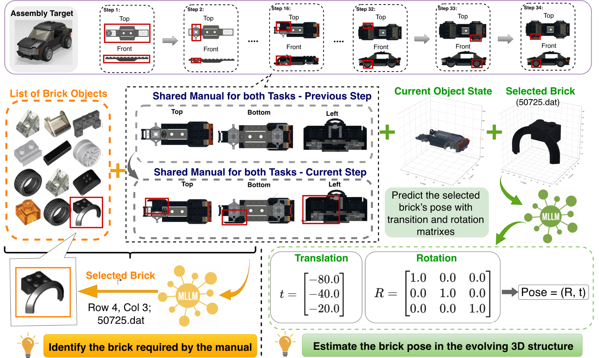
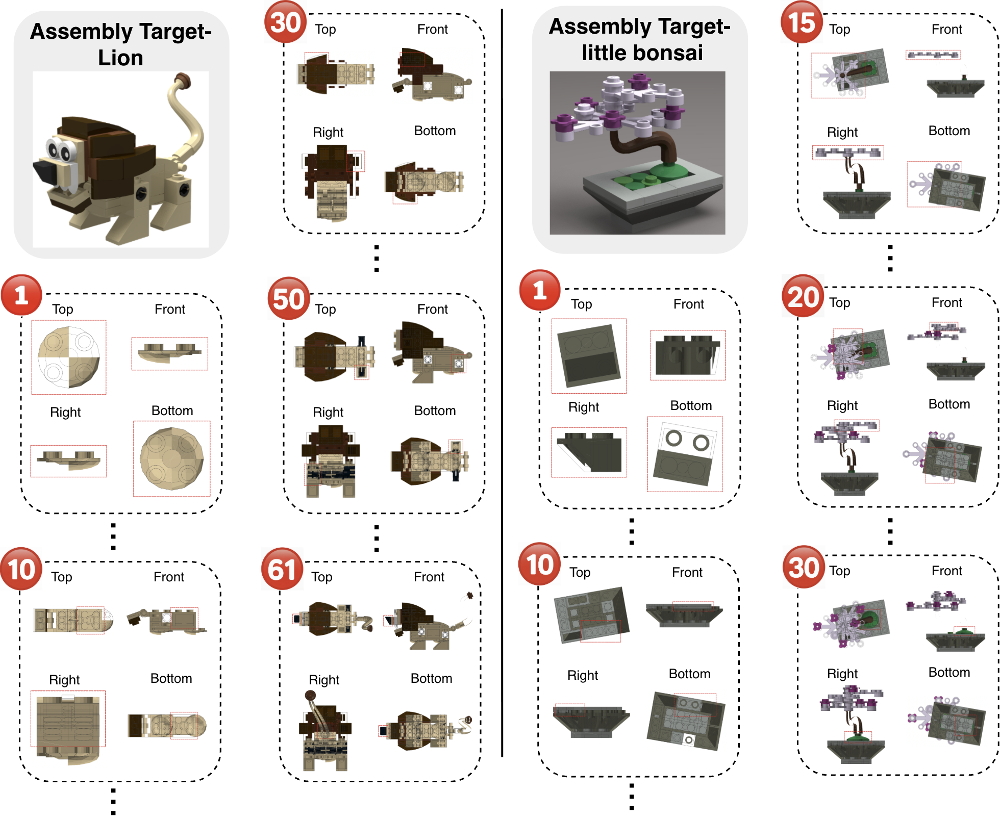
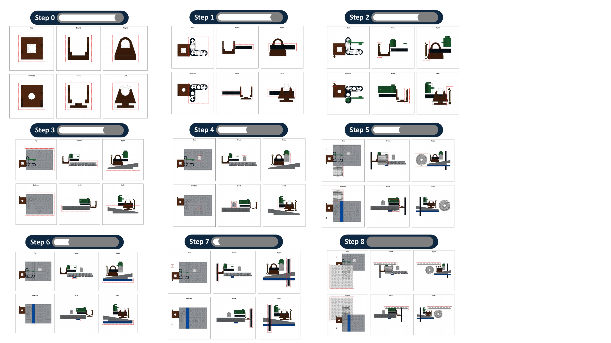
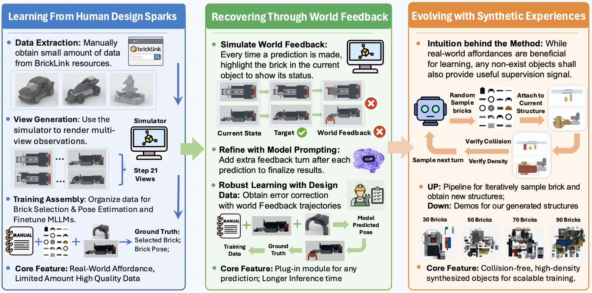
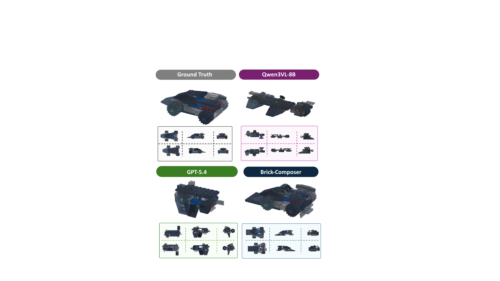

# Brick-Composer: MLLMs Construct Everything from Building Blocks

**[Project Page](https://lumos-jiateng.github.io/Brick-Composer/)** | **[Paper](docs/assets/Brick-Composer-paper.pdf)**

Official repository for **"Brick-Composer: MLLMs Construct Everything from Building Blocks"**

Jiateng Liu, Bingxuan Li, Zhenhailong Wang, Rushi Wang, Kaiwen Hong, Cheng Qian, Jiayu Liu, Denghui Zhang, Katherine Driggs-Campbell, Manling Li, Heng Ji

UIUC · Stevens Institute of Technology · Northwestern University

> [!NOTE]
> **This repository was created and organized with the help of an AI assistant.** While we have
> done our best to keep the code and dataset links correct and reproducible, some rough edges may
> remain. If you hit any problems, inconsistencies, or replication difficulties, please
> [open an issue](https://github.com/Lumos-Jiateng/Brick-Composer/issues) — we're happy to help.

**Quick links:** [📦 Datasets](#datasets) · [🧪 Evaluation Code](#evaluation-code) · [🏋️ Training](#training)

---

## About

We study whether multimodal large language models (MLLMs) can read arbitrary designs and construct real-world objects from reusable building blocks. We formulate brick assembly as a **sequential decision-making** problem with two subtasks:

- **Brick Selection** — identify the target component from a candidate catalog grid.
- **Brick Pose Estimation** — predict where (position) and how (6-DoF orientation) the selected brick should be placed.

We introduce **BC-Bench**, a benchmark for evaluating MLLMs on assembly with diverse bricks, and propose **Brick-Composer**, a learning framework combining **Human Design Sparks**, **World Feedback**, and **Synthetic Experience**.

<p align="center">
  
  <br/>
  <em>Overview of the BC-Bench task setting. <b>Left:</b> brick selection — the model picks the required brick from a candidate grid. <b>Right:</b> brick pose estimation — given the manual context, current state, and the selected brick, the model predicts its target pose (translation vector + rotation matrix).</em>
</p>

## Key Results

| Approach | Selection ↑ | Trans. Err ↓ | Rot. Err ↓ | Step-Wise SR ↑ |
|---|---|---|---|---|
| Qwen-3-VL-8B (Direct) | 22.76 | 210.14 | 62.47 | 0.36 |
| Brick-Composer | **68.21** | **65.63** | **37.97** | **14.27** |

- **3×** improvement in brick selection accuracy
- Strict step-level assembly success from <1% → **~15%**

## Datasets

All datasets are hosted on the Hugging Face Hub under [`Lumos-Jiateng`](https://huggingface.co/Lumos-Jiateng):

| Dataset | Hub repo | What it contains |
|---|---|---|
| **Brick / Design data** | [`Lumos-Jiateng/bricklink_lego_design`](https://huggingface.co/datasets/Lumos-Jiateng/bricklink_lego_design) | BrickLink part library and per-object LEGO designs (the brick vocabulary and source designs). |
| **Synthetic Experience** | [`Lumos-Jiateng/brick_synthetic`](https://huggingface.co/datasets/Lumos-Jiateng/brick_synthetic) | Large-scale synthetic assembly trajectories for the *Synthetic Experience* stage. |
| **Designer Supervision** | [`Lumos-Jiateng/brick_synthetic`](https://huggingface.co/datasets/Lumos-Jiateng/brick_synthetic) | Step-by-step supervision (renders + selection/pose ground truth) for 102 real, human-designed objects — the *Human Design Sparks* signal. |

> [!IMPORTANT]
> The **Designer Supervision** data (the *Human Design Sparks* split) is **also packaged inside the
> [`Lumos-Jiateng/brick_synthetic`](https://huggingface.co/datasets/Lumos-Jiateng/brick_synthetic)
> repository**, so you can obtain both the synthetic trajectories and the real human-designed
> supervision from a single download.

Quick download example:

```python
from huggingface_hub import snapshot_download
# Synthetic experience + Designer Supervision (human design sparks) in one place
snapshot_download(repo_id="Lumos-Jiateng/brick_synthetic", repo_type="dataset")
# Brick / design library
snapshot_download(repo_id="Lumos-Jiateng/bricklink_lego_design", repo_type="dataset")
```

<p align="center">
  
  <br/>
  <em>Example assembly trajectories in BC-Bench. Red boxes highlight the brick to add at each step, while multi-view manuals expose geometric and affordance cues.</em>
</p>

<p align="center">
  
  <br/>
  <em>Synthesized assembly configurations used for the Synthetic Experience stage. Structures are grown by incrementally attaching sampled bricks at feasible connection points, filtering invalid placements via collision and connectivity checks.</em>
</p>

## Method

Brick-Composer combines three complementary sources of supervision: affordance-rich human-designed assemblies (**Human Design Sparks**), simulator-based **World Feedback** for error recovery, and procedurally generated **Synthetic Experience** for scalable spatial learning.

<p align="center">
  
  <br/>
  <em>The Brick-Composer learning framework improves assembly reasoning through three complementary signals — human design supervision, world feedback for error recovery, and scalable synthetic objects for experience expansion.</em>
</p>

## Evaluation Code

The evaluation code talks to a local [vLLM](https://github.com/vllm-project/vllm)
OpenAI-compatible server. Minimal client dependencies:

```bash
pip install openai pillow
```

1. Serve a Vision-Language Model with vLLM (e.g. Qwen-3-VL) and note its host/port.
2. Set the endpoint in the relevant `api_client.py`.
3. Download the datasets above and point the scripts at the extracted folders.
4. Run a subtask:

```bash
# Brick Selection
cd reasoning/MLLM_Brick_Selection && python run.py

# Brick Pose Estimation
cd reasoning/MLLM_Brick_Pose_Estimation && bash run_real_synthetic.sh
```

Per-task details:
[`reasoning/MLLM_Brick_Selection`](reasoning/MLLM_Brick_Selection/README.md) ·
[`reasoning/MLLM_Brick_Pose_Estimation`](reasoning/MLLM_Brick_Pose_Estimation/README.md).

> [!TIP]
> The **prepared LLaMA-Factory data files** (already converted to the multimodal instruction
> format used for fine-tuning and evaluation) are **included in the
> [`Lumos-Jiateng/brick_synthetic`](https://huggingface.co/datasets/Lumos-Jiateng/brick_synthetic)
> repository**. After downloading and unzipping the content, you only need to **update the image
> paths** in those files to point to your local extraction directory — no reformatting required.

## Training

We fine-tune the Vision-Language Models with **[LLaMA-Factory](https://github.com/hiyouga/LLaMA-Factory)**,
which provides a clean and efficient pipeline for supervised fine-tuning of MLLMs. The Designer
Supervision and Synthetic Experience data are converted into LLaMA-Factory's multimodal
instruction format, and training is launched with its standard SFT recipes.

The **ready-to-use LLaMA-Factory data files are already included in the
[`Lumos-Jiateng/brick_synthetic`](https://huggingface.co/datasets/Lumos-Jiateng/brick_synthetic)
repository**, so you do not need to regenerate them. After downloading and unzipping the dataset,
the only required change is to **update the image paths** inside these files to match your local
extraction directory; everything else (prompts, conversation structure, labels) is ready as-is.

At inference time, the fine-tuned checkpoints are served with **[vLLM](https://github.com/vllm-project/vllm)**
via its OpenAI-compatible API; the evaluation scripts in this repo then query that endpoint (see
each `api_client.py`).

We gratefully acknowledge the [LLaMA-Factory](https://github.com/hiyouga/LLaMA-Factory) and
[vLLM](https://github.com/vllm-project/vllm) teams — this work would not have been possible without
their excellent open-source tooling.

## Qualitative Examples

<p align="center">
  
  <br/>
  <em>Qualitative examples of model assembly. Brick-Composer recovers more coherent object-level structure across multiple construction steps.</em>
</p>

## Citation

```bibtex
@misc{liu2026brickcomposer,
  title  = {Brick-Composer: MLLMs Construct Everything from Building Blocks},
  author = {Liu, Jiateng and Li, Bingxuan and Wang, Zhenhailong and Wang, Rushi and Hong, Kaiwen and Qian, Cheng and Liu, Jiayu and Zhang, Denghui and Driggs-Campbell, Katherine and Li, Manling and Ji, Heng},
  year   = {2026},
  url    = {https://github.com/Lumos-Jiateng/Brick-Composer}
}
```

## Acknowledgements

This project builds on [LLaMA-Factory](https://github.com/hiyouga/LLaMA-Factory) (training) and
[vLLM](https://github.com/vllm-project/vllm) (serving). We thank the authors and maintainers of
these projects. The repository and its documentation were organized with the assistance of an AI
coding assistant.
